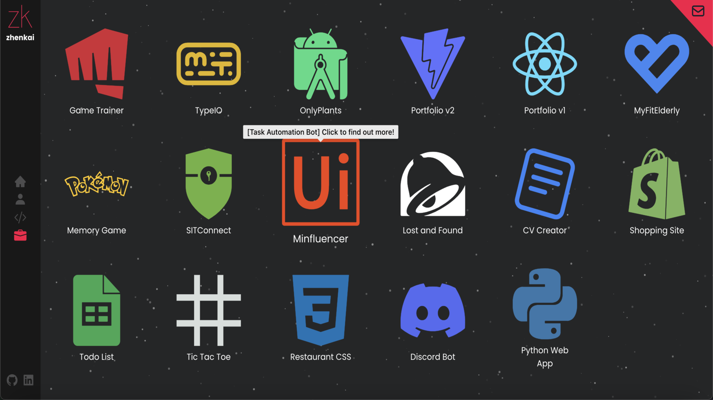
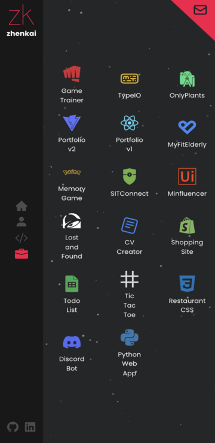

	<h1>Zhenkai's Portfolio v2
	 
		
		
		
		
		
		 
	</h1>
	<h3><b><a href="https://hzk2021.github.io/portfoliov2">View Live Demo</a></b></h3>

## Description

Zhenkai's revamped portfolio site.

## Built Using

- Vite 
- React 
- TypeScript 
- ChakraUI 
- React Router 

#### Libraries

- [Framer Motion](https://www.framer.com/motion/)
- [tsParticles](https://particles.js.org/)

#### Icons

- [React Icons](https://github.com/react-icons/react-icons)

#### Other

- [Tag Cloud](https://github.com/Frank-Mayer/react-tag-cloud)

## Preview

#### Desktop

#### Mobile

